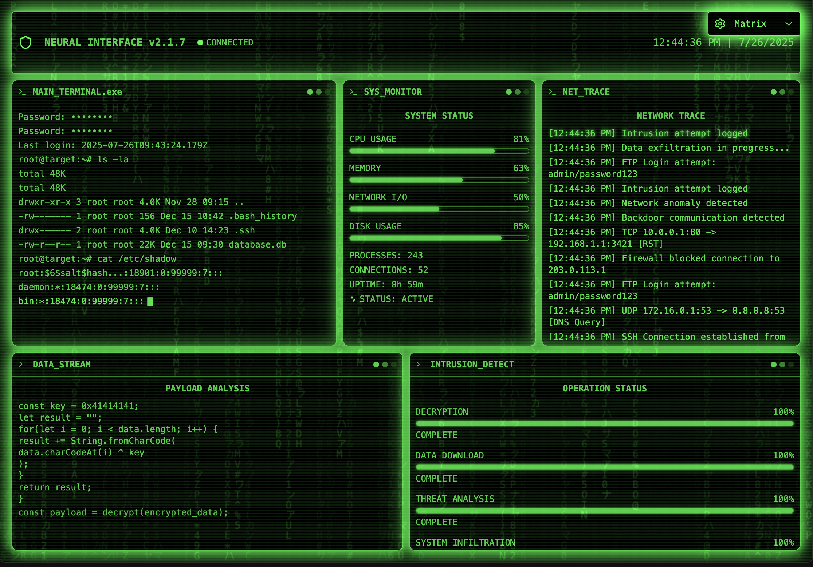

# CyberCine



A modern web application built with Vite, React, TypeScript, and Tailwind CSS.

🌐 **Live Demo**: [https://makalin.github.io/CyberCine/](https://makalin.github.io/CyberCine/)

## Features
- Fast development with Vite
- Type-safe code with TypeScript
- Utility-first styling with Tailwind CSS

## Getting Started

### Prerequisites
- Node.js (v16 or higher recommended)
- npm (v8 or higher)

### Installation

```bash
npm install
```

### Development

Start the development server:

```bash
npm run dev
```

### Build

Build the app for production:

```bash
npm run build
```

### Preview

Preview the production build:

```bash
npm run preview
```

## Project Structure

- `src/` - Source code (components, styles, etc.)
- `public/` - Static assets
- `index.html` - Main HTML file

## Deployment

### GitHub Pages

This project is configured for automatic deployment to GitHub Pages.

#### Manual Deployment

1. Install the gh-pages package:
   ```bash
   npm install gh-pages --save-dev
   ```

2. Update the `homepage` field in `package.json` with your GitHub username:
   ```json
   "homepage": "https://makalin.github.io/CyberCine"
   ```

3. Deploy to GitHub Pages:
   ```bash
   npm run deploy
   ```

#### Automatic Deployment (GitHub Actions)

The project includes a GitHub Actions workflow that automatically builds and deploys to GitHub Pages when you push to the main branch.

1. Push your code to GitHub
2. Go to your repository settings
3. Navigate to "Pages" in the sidebar
4. Select "GitHub Actions" as the source
5. The site will be available at `https://makalin.github.io/CyberCine`

## License

This project is licensed under the MIT License. 